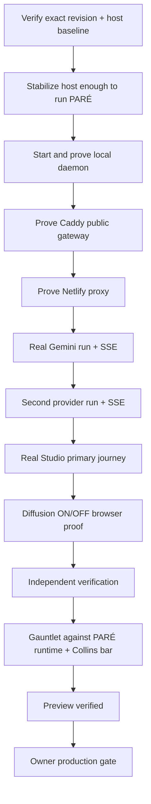

# Task graph

## Node table

| ID | Output | Reads | Writes/owns | Acceptance | Skill/reference | Risk | Human gate |
|---|---|---|---|---|---|---|---|
| A | exact revision + host resource baseline | GitHub PR head, VPS git/resource state | run evidence only | exact SHA recorded; `uptime/free/vmstat/docker stats` captured | brownfield wiring audit/evidence | low | none |
| B | stable host budget for PARÉ | A, active service inventory | PARÉ service/build leftovers only unless clearly justified | host can fork/start Node without pathological thrash; protected services remain healthy | runtime ops, minimum ladder | high | stop if touching unknown/critical service |
| C | local daemon health proof | B, compose/systemd, daemon logs | PARÉ service/container | `127.0.0.1:7456` listening + `/api/health` 200 | wiring audit | medium | none |
| D | public gateway health | C, Caddy config | PARÉ-specific Caddy stanza only if needed | TLS public `/pare/api/health` 200, 7456 still private | wiring/security | medium | none unless protected Caddy routes affected |
| E | Netlify proxy health | D, rewrite config | no code unless mismatch proven | preview `/api/health` 200; POST/SSE path preserved | wiring | medium | none |
| F | Gemini real model proof | E, provider registry/secrets | run state only | real run + SSE delta + terminal success | provider/runtime | medium | none |
| G | second provider proof | F | run state only | second configured provider real stream success | provider/runtime | medium | none |
| H | Studio primary journey | F/G, deployed preview | no source mutation | select model -> send -> real streamed response | Collins/product + browser | medium | none |
| I | diffusion real-stream proof | H, DiffusionOverlay | no source mutation unless defect discovered | visible toggle; ON works; OFF normal; exact final text | motion + accessibility | medium | none |
| J | fresh verification receipt | all evidence | run receipt | builder claims independently rechecked | evidence/unlazy | low | none |
| K | gauntlet score | J, bar, preview | GAUNTLET.md | floors met and critical failures 0 | Gauntlet Loop | low | none |
| L | PREVIEW VERIFIED state | K | run state/receipt | exact preview revision and primary journey verified | release standard | low | none |
| M | production release | L | main/production runtime | explicit owner `approve` + post-release proof | release standard | high | REQUIRED |

## Graph admission
- One vertical path first; no broad fan-out before local daemon health.
- No parallel writers to Caddy/service/repo.
- Resource diagnosis may inspect all services but may mutate only clearly identified PARÉ leftovers without an additional consequential gate.
- No production/main mutation is admitted.
- If evidence isolates a source-code defect, create one bounded repair node before C/D and re-run dependent evidence.
